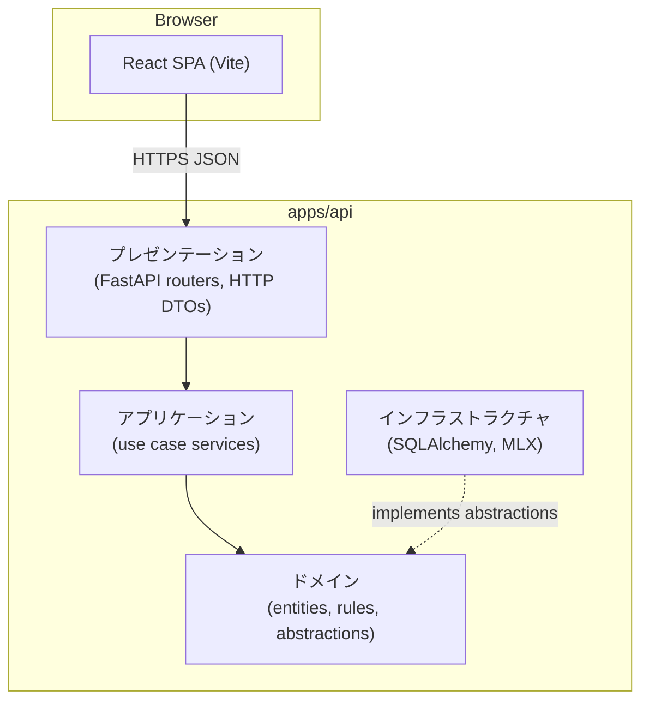
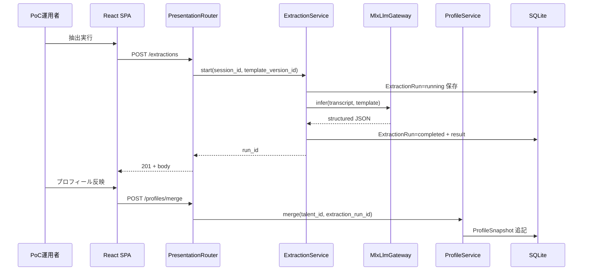
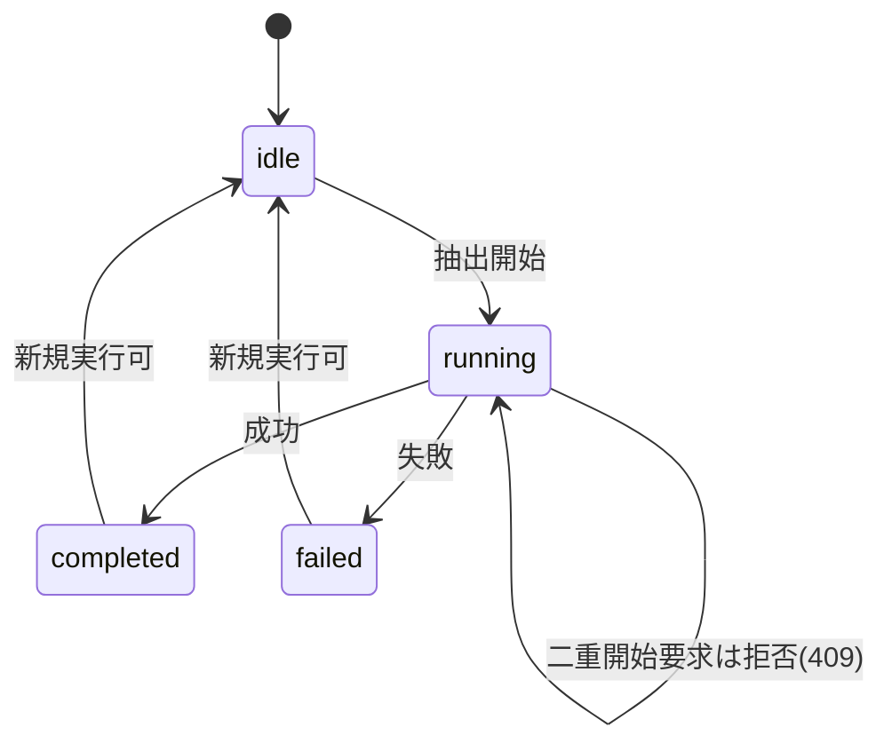
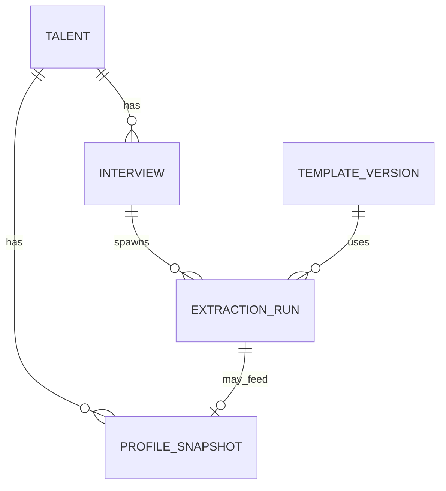

# Design Document: talent-interview-profile-poc

---
**Purpose**: 面談テキストと YAML テンプレから人材プロフィールを構築し、最小 PoC UI とエクスポートで役員説明可能なデモを実現する実装の契約と境界を固定する。
---

## Overview

**目的**: 文字起こし済み面談テキストを、YAML で宣言した観点に沿って構造化し、**人材プロフィール**として永続化する。PoC 運用者は **単一の最小 Web UI** から主要フローを完遂でき、営業役員には **UI・JSON エクスポート・静的サマリ**のいずれでも根拠追跡可能な説明ができる。

**利用者**: PoC 運用者（データ入力・抽出・反映）、営業役員（閲覧・評価）。

**影響**: リポジトリに **API（Python・レイヤード構成）**、**Web フロント（TypeScript・同趣旨の層分割）**、**SQLite 永続化**、**インフラストラクチャ層のオンデバイス推論（既定: MLX）** を新設する。

### Goals

- 人材・面談・テンプレ・抽出実行・プロフィール反映の **主要フローを UI 完結**。
- **YAML テンプレの検証とバージョン管理**、抽出結果と **テンプレ版・入力のトレース**。
- **再現可能なデモ**（手順書 + 入力ハッシュ等のメタデータ）。
- **対象外要求**（発注側、マッチング等）に API が誤応答しない。

### Non-Goals

- 本番運用コンソール、マルチテナント、高度 RBAC。
- 音声認識、SNS／GitHub コネクタ、マッチングアルゴリズム。
- 法令対応レベルの同意・削除・監査の完全実装（最低限の運用注意は記載）。

## Boundary Commitments

### This Spec Owns

- **人材**、**面談セッション**、**テンプレート版**、**抽出実行（ExtractionRun）**、**プロフィールスナップショット／履歴** の永続化モデルと整合性ルール。
- **抽出オーケストレーション**（テンプレ適用、推論呼び出し、結果保存、失敗時の状態遷移）。
- **最小 Web UI** と **REST（OpenAPI）** による同等操作の提供。
- **デモ用エクスポート**（JSON）および **静的 HTML サマリ生成**（ビルド時またはオンデマンドのいずれかを実装で選択）。

### Out of Boundary

- 発注側・案件エンティティ、マッチング、ランキング、マッチ理由生成。
- 本番ガバナンスの完成品（同意ワークフロー等）。
- クラウド LLM を **既定経路** とする運用（研究用の手動切替は設計外。採用しない）。

### Allowed Dependencies

- **上流**: 文字起こし済みプレーンテキスト（UTF-8）。最大サイズは設定可能な定数（例: 512KiB）で拒否。
- **ランタイム**: macOS Apple Silicon を主ターゲットとし、**MLX（`mlx-lm`）** を既定推論。開発用に CPU のみ環境がある場合は明示的に「非推奨」とログする（完全互換は求めない）。
- **外部ネットワーク**: PoC 既定では **推論にネットワークを要求しない**。

### Revalidation Triggers

- テンプレ YAML の **スキーマ形状**変更。
- `StructuredExtractionGateway`（ドメイン抽象）の **入出力契約**変更。
- プロフィールの **正規表現スキーマ**変更。
- SQLite から他ストアへの移行。

## Architecture

### Existing Architecture Analysis

既存アプリケーションなし。新規モノレポ構成で追加する。

### Architecture Pattern & Boundary Map

**パターン**: **レイヤードアーキテクチャ**（厳密な依存方向）。**上位レイヤは下位レイヤのみを参照**し、**インフラストラクチャ層**がドメインが定める抽象（リポジトリ・推論ゲートウェイ等）を実装する。

| レイヤ（API 側） | 責務 |
|------------------|------|
| **プレゼンテーション** | HTTP（FastAPI ルーター）、リクエスト／レスポンス DTO、ステータスコード整形。ビジネスルールを持たない。 |
| **アプリケーション** | ユースケース単位のオーケストレーション（トランザクション境界、サービス呼び出し順）。 |
| **ドメイン** | エンティティ、ドメイン例外、不変条件、**リポジトリ／推論への抽象**（Protocol / ABC）。外部 I/O を import しない。 |
| **インフラストラクチャ** | SQLAlchemy、SQLite、MLX 呼び出し等の具体実装。ドメインの抽象に対して実装を提供する。 |

**境界**: **Web（React）↔ API（プレゼンテーション）↔ アプリケーション ↔ ドメイン ← インフラストラクチャ**。ブラウザは REST のみ。API 内では **プレゼンテーション → アプリケーション → ドメイン** の一方向。インフラは **ドメインの抽象に依存**して組み立てる（古典的な依存性逆転）。



`main.py`（composition root）がインフラ具体クラスを組み立て、アプリケーションサービスに**注入**する（図では省略）。

**依存の補足**: 実行時のワイヤリング（DI）ではアプリケーション層がインフラの具体クラスを**構築・注入**してよいが、**アプリケーションの import グラフ**は原則としてドメイン抽象に向かい、インフラの具体モジュールへの直接依存は **main／composition root** に閉じる（PoC では `main.py` での組み立てを許容）。

**Steering 整合**: `tech.md` の型安全・テスト容易性に合わせ、**Pydantic** と **TypeScript strict** を採用する。

### Technology Stack

**バージョン方針**: 言語・主要ライブラリは **実装着手時点の最新安定版**を採用し、`uv.lock`（Python）および `pnpm-lock.yaml`（Node）で **再現可能に固定**する。下表のバージョンは **本ドキュメント作成時点（2026-04）の目安**であり、ロックファイルが正とする。

| Layer | Choice / Version（目安） | 本機能での役割 | メモ |
|-------|--------------------------|----------------|------|
| Frontend | **Vite 6** + **React 19** + **TypeScript 5.8+（strict）** | 最小 PoC UI | `any` 禁止 |
| Backend | **Python 3.14**（3.14.x 最新マイナー）+ **FastAPI**（最新安定）+ **Pydantic v2**（最新安定） | REST、検証、オーケストレーション | 型ヒント必須。`requires-python` は `>=3.14,<3.15` を目安にロック |
| Data | **SQLite** + **SQLAlchemy 2.x**（最新安定） | 永続化 | 単一ファイル `data/poc.db` 想定 |
| Inference | **MLX / `mlx-lm`（当該時点の最新安定）** 既定 | 構造化抽出 | CoreML は後続スパイク（`research.md`） |
| Messaging | なし | — | PoC では非採用 |
| ツールチェーン | **`uv`**（Python）+ **`pnpm`**（Node） | 依存解決・ロック・スクリプト実行 | 下記「パッケージマネージャ」参照 |

### パッケージマネージャ（Python）

- **推奨（既定）**: **`uv`**（高速なロック、`pyproject.toml` 一体管理、仮想環境管理まで含む）。PoC の摩擦が小さい。
- **代替**: **`pixi`**（conda-forge 連携や科学計算スタックの一元管理が主目的の場合）、**Poetry**（成熟エコシステム）。いずれもチーム標準があれば採用可。
- **結論**: 本設計では **`uv` を既定**とする。`uv` で問題ない場合は **変更しない**。

## File Structure Plan

レイヤードアーキテクチャに合わせ、**API パッケージ内を `presentation` / `application` / `domain` / `infrastructure` の 4 層**で分割する。フロントも同じ語彙で **プレゼンテーション（画面）／アプリケーション（画面手続き）／インフラ（HTTP クライアント）** に分ける（ブラウザ側ドメイン層は必須としない）。

### Directory Structure

```
apps/
├── api/
│   ├── pyproject.toml                  # uv（既定）で管理
│   ├── uv.lock                         # 実装時に生成・コミット
│   ├── README.md
│   └── src/
│       └── talent_interview_profile_poc/
│           ├── main.py                 # composition root: FastAPI 生成、層のワイヤリング
│           ├── settings.py             # 環境設定（DB パス、モデル名、サイズ上限）
│           ├── presentation/
│           │   ├── routers/
│           │   │   ├── talents.py
│           │   │   ├── interviews.py
│           │   │   ├── templates.py
│           │   │   ├── extractions.py
│           │   │   ├── profiles.py
│           │   │   └── exports.py      # JSON / HTML サマリ
│           │   └── schemas/            # HTTP 入出力 DTO（API 境界専用）
│           │       ├── talent.py
│           │       ├── interview.py
│           │       └── ...
│           ├── application/
│           │   └── services/
│           │       ├── talent_service.py
│           │       ├── interview_service.py
│           │       ├── template_service.py
│           │       ├── extraction_service.py
│           │       └── profile_service.py
│           ├── domain/
│           │   ├── entities/
│           │   ├── exceptions.py
│           │   └── abstractions/
│           │       ├── repositories.py    # Protocol: TalentRepository 等
│           │       └── inference.py       # Protocol: StructuredExtractionGateway
│           └── infrastructure/
│               ├── persistence/
│               │   ├── database.py
│               │   ├── orm_models.py
│               │   └── repositories_sqlalchemy.py
│               └── inference/
│                   └── mlx_llm_gateway.py
├── web/
│   ├── package.json
│   ├── pnpm-lock.yaml                  # 実装時に生成・コミット
│   ├── tsconfig.json                   # strict, noImplicitAny 等
│   └── src/
│       ├── main.tsx
│       ├── App.tsx
│       ├── presentation/
│       │   ├── routes/
│       │   ├── pages/
│       │   │   ├── TalentsPage.tsx
│       │   │   ├── TalentDetailPage.tsx
│       │   │   ├── TemplatesPage.tsx
│       │   │   └── DemoHelpPage.tsx
│       │   └── components/
│       │       └── RegisterSlideOver.tsx
│       ├── application/
│       │   └── hooks/
│       └── infrastructure/
│           └── http/
│               └── client.ts
└── shared/                             # 任意: OpenAPI 生成型（後続）
data/
docs/
└── demo/
    └── talent-interview-profile-poc.md
examples/
└── templates/
    └── default_template.yaml
```

### Modified Files

- 既存コードなし。ルートに **`README.md` 更新**（起動方法）、**`.gitignore` に `data/*.db`** を追加予定。

## System Flows

### 抽出〜反映（ハッピーパス）



### 同一セッション並行抽出の拒否



## Requirements Traceability

| Requirement | 要約 | Components | Interfaces | Flows |
|-------------|------|--------------|------------|-------|
| 1 | 人材 CRUD | `application/services/talent_service`, `presentation/routers/talents`, `infrastructure/persistence/repositories_sqlalchemy` | REST `/talents` | — |
| 2 | 面談取込・一覧 | `application/services/interview_service`, `presentation/routers/interviews` | REST `/talents/{id}/interviews` | 抽出フロー入力 |
| 3 | YAML テンプレ | `application/services/template_service`, `presentation/routers/templates` | REST `/templates` | テンプレ検証 |
| 4 | 抽出実行 | `application/services/extraction_service`, `infrastructure/inference/mlx_llm_gateway` | REST `/extractions`, `StructuredExtractionGateway` | 上記シーケンス |
| 5 | プロフィール反映・履歴 | `application/services/profile_service`, `presentation/routers/profiles` | REST `/profiles/...` | マージフロー |
| 6 | デモ再現・説明 | `presentation/routers/exports`, `presentation/pages/DemoHelpPage`, `TalentsPage`, `TemplatesPage`, `components/RegisterSlideOver`, `docs/demo/*.md` | REST `/exports`, UI | 静的サマリ生成 |
| 7 | 対象外拒否 | ルート非提供 + アプリケーション層のガード | — | — |

## Components and Interfaces

| Component | Layer | Intent | Req Coverage | Key Dependencies | Contracts |
|-----------|-------|--------|--------------|------------------|-----------|
| `presentation/routers/*` | プレゼンテーション | HTTP 境界、DTO 変換 | 1–7 | アプリケーションサービス | OpenAPI |
| `TalentService` 等 | アプリケーション | ユースケースオーケストレーション | 1–6 | ドメイン抽象（Repository / Gateway） | サービス API |
| エンティティ・例外 | ドメイン | 不変条件と意味 | 1–5 | なし（抽象のみ） | 純ドメイン |
| `repositories_sqlalchemy` | インフラストラクチャ | ORM 永続化 | 1–5 | SQLite, SQLAlchemy | `*Repository` Protocol |
| `mlx_llm_gateway` | インフラストラクチャ | オンデバイス推論 | 4 | mlx-lm | `StructuredExtractionGateway` |
| `presentation/pages/*`, `presentation/components/RegisterSlideOver` | プレゼンテーション（Web） | 最小画面・一覧＋右スライド登録 | 1–6 | `infrastructure/http/client` | props 型 |

### プレゼンテーション（API）

#### FastAPI Routers 群

| Field | Detail |
|-------|--------|
| Intent | HTTP 契約の境界。バリデーションとステータスコード整形。 |
| Requirements | 1, 2, 3, 4, 5, 6, 7 |

**Responsibilities & Constraints**

- **422**: YAML／テキスト形式エラー。 **404**: 存在しない ID。 **409**: 同一セッションで `running` の抽出があるときの新規実行。
- **7**: 発注・マッチング等のルートは **定義しない**。誤要求は 404。

**Dependencies**

- Inbound: React SPA（Criticality P0）
- Outbound: 各アプリケーションサービス（P0）

**Contracts**: API [x]

##### API Contract（代表）

| Method | Path | Request | Response | Errors |
|--------|------|---------|----------|--------|
| POST | `/talents` | `{family_name, given_name, family_name_kana, given_name_kana}` | Talent（`display_label` 含む） | 422 |
| GET | `/talents/{id}` | — | Talent | 404 |
| PATCH | `/talents/{id}` | 上記の部分フィールド（1 つ以上） | Talent | 404, 422 |
| POST | `/talents/{id}/interviews` | `{transcript_text}` | `{interview_session_id}` | 404, 422 |
| GET | `/talents/{id}/interviews` | — | list | 404 |
| POST | `/templates` | `{yaml_text}`（ルートに **`purpose`** 必須） | `{template_version_id, semver}` | 422 |
| GET | `/templates` | — | list | — |
| POST | `/extractions` | `{interview_session_id, template_version_id}` | `{extraction_run_id, status}` | 404, 409, 422 |
| GET | `/extractions/{run_id}` | — | ExtractionRun | 404 |
| POST | `/profiles/merge` | `{talent_id, extraction_run_id}` | Profile | 404, 422 |
| GET | `/talents/{id}/profile/history` | — | list | 404 |
| GET | `/exports/talents/{id}.json` | — | JSON ファイル | 404 |
| GET | `/exports/talents/{id}.html` | — | HTML | 404 |

※ 正確なフィールド名は実装で OpenAPI に固定する。

### ドメイン

#### StructuredExtractionGateway（抽象）

| Field | Detail |
|-------|--------|
| Intent | テンプレ駆動プロンプトと面談テキストから **JSON 結果** を返す（ドメインが要求する契約）。 |
| Requirements | 4 |

##### 契約（`domain/abstractions/inference.py` の Protocol 相当）

```python
class StructuredExtractionInput:
    transcript_text: str
    template_yaml: str
    template_version_id: str

class StructuredExtractionOutput:
    data: dict[str, object]
    model_id: str
    prompt_fingerprint: str

class StructuredExtractionGateway:
    def infer(self, inp: StructuredExtractionInput) -> StructuredExtractionOutput: ...
```

- **Preconditions**: 入力サイズ上限以内。テンプレは検証済みバージョンを渡す。
- **Postconditions**: **JSON オブジェクト**（dict）を返す。数値／文字列／配列のみを許容するなど整形ルールは `TemplateService`（アプリケーション層）で後処理してもよい。
- **Invariants**: 既定実装は外部ネットワークを呼ばない。

**Implementation Notes**

- 具体実装は **`infrastructure/inference/mlx_llm_gateway.py`** に置く。温度・top-k 等は **設定**で固定し、再現性（要件 6）に寄与させる。

### プレゼンテーション（Web）

#### React SPA

| Field | Detail |
|-------|--------|
| Intent | コア業務の画面完結（要件 6.3）。 |
| Requirements | 1, 2, 3, 4, 5, 6 |

**Implementation Notes**

- **人材一覧**（`TalentsPage`）および**テンプレート一覧**（`TemplatesPage`）では **一覧を主画面**とし、新規登録は **「登録」系ボタン押下で右からスライドインするパネル**（`RegisterSlideOver`）内のフォームで行う。一覧の上に常設の登録フォームは置かない。
- フォーム送信後のトースト／エラーメッセージで **422/409** を人間可読に（パネル内または一覧下に表示）。
- `TalentDetailPage` に **根拠リンク**（どの面談・どの抽出 run か）を表示し、要件 6.2 を満たす。

## Data Models

### Domain Model

- **Talent**: `id`（UUID）、`family_name`、`given_name`、`family_name_kana`、`given_name_kana`、`created_at`。API 応答では一覧用に `display_label`（「姓 名」）を返す。
- **InterviewSession**: `id`, `talent_id`, `transcript_text`（原文）、`created_at`。
- **TemplateVersion**: `id`, `semver_or_label`, **`purpose`**（用途・一覧表示）, `yaml_text`, `created_at`。
- **ExtractionRun**: `id`, `interview_session_id`, `template_version_id`, `status`（`pending|running|completed|failed`）、`result_json`、`error_message`、`input_hash`、`model_id`、`prompt_fingerprint`、`created_at`。
- **ProfileSnapshot**: `id`, `talent_id`, `merged_profile_json`, `source_extraction_run_id`, `created_at`。



### Logical Data Model

- **InterviewSession.transcript_text**: PoC では SQLite TEXT。上限超えは API で拒否。
- **ExtractionRun.result_json**: 抽出の生結果。`ProfileService` が検証後にスナップショットへ反映。
- **整合性**: `ProfileSnapshot` は必ず `source_extraction_run_id` を持つ（要件 5.4）。

### Physical Data Model（SQLite）

- テーブル: `talents`（`family_name`, `given_name`, `family_name_kana`, `given_name_kana`）、`interview_sessions`, `template_versions`, `extraction_runs`, `profile_snapshots`。
- インデックス: `extraction_runs(interview_session_id, status)` で `running` 検索を高速化。
- **マイグレーション**: PoC では `create_all` または Alembic 導入は実装タスクで選択（設計上はスキーマ差分をコミット可能にする）。

## Error Handling

### Error Strategy

- **ユーザー／運用者起因**: フィールド単位メッセージ（Pydantic の `422`）。
- **競合**: `409` + 簡潔な理由コード（例: `extraction_already_running`）。
- **推論失敗**: `ExtractionRun=failed` にし、UI は再試行を提示。ログには原文をマスクまたは短縮。

### Error Categories

| 種別 | 例 | 応答 |
|------|-----|------|
| 入力不備 | 空テキスト、YAML 構文エラー | 422 |
| 状態競合 | 同一セッション二重抽出 | 409 |
| 推論例外 | MLX 内部エラー | 500 または 422（実装でマッピング方針を固定） |

### Monitoring

- PoC: **構造化ログ**（JSON 1 行）を標準出力。本番用 APM は導入しない。

## Testing Strategy

### Unit（例）

1. `application/services/template_service.py` の `TemplateService` が **不正 YAML** を拒否しメッセージを返す（要件 3.3）。
2. `application/services/extraction_service.py` の `ExtractionService` が **running 存在時**に新規開始を拒否する（要件 4.3）。
3. `application/services/profile_service.py` の `ProfileService` が **不正な result_json** をマージ拒否する（要件 5.3）。
4. `input_hash` が同一入力で安定すること（要件 6.1 の補助）。

### 結合（例）

1. `POST /talents` → `POST /interviews` → `POST /templates` → `POST /extractions` → `GET` で `completed` を確認。
2. `POST /profiles/merge` 後に `GET /talents/{id}` 相当でプロフィールが観察できる（要件 5.1）。
3. `GET /exports/...json` が **面談 id / template version / extraction run** を含む（要件 6.2）。

### E2E / UI（任意だが推奨）

1. Playwright または Cypress で **1 人材のハッピーパス**（要件 6.3）。
2. 409 競合の UI 表示。

### 性能

- PoC 既定では **定量 SLO なし**。実装タスクで「代表モデル＋代表原稿」のレイテンシを 1 回記録する。

## Security Considerations

- ネットワーク送信をしない既定推論経路（研究の `research.md` と整合）。
- ローカル DB ファイルのアクセス権は OS ユーザーに限定（README に記載）。
- ログへの **全文ダンプ禁止**（開発時も原則マスク）。

## Supporting References

- 詳細な MLX／CoreML 比較は `.kiro/specs/talent-interview-profile-poc/research.md`。
